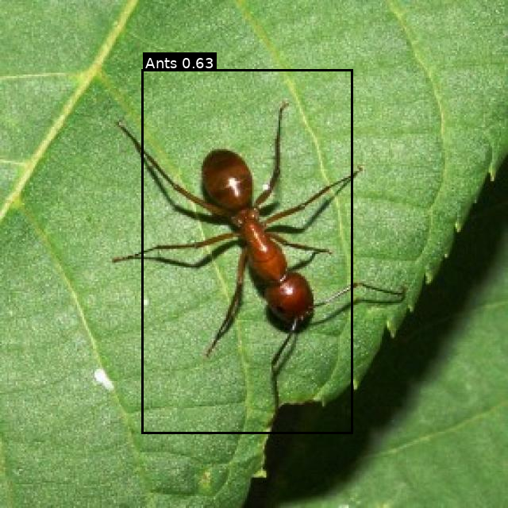

# Crop Pest Detection

Автоматическая детекция сельскохозяйственных вредителей на изображениях с использованием модели **Faster R-CNN ResNet50-FPN** и MLOps-стека: **uv**, **DVC**, **MLflow**, **Triton Inference Server**, **MinIO**, **PostgreSQL**, **docker-compose**.

## 1) Быстрый старт

### Требования

- Python **3.12**
- **uv**
- **Docker** + docker compose
- Для GPU-инференса/обучения на Linux/WSL2: NVIDIA Driver + NVIDIA Container Toolkit

> На macOS (MPS) обучение возможно, но часть ops в torchvision detection может быть нестабильной. Для стабильности используйте CPU или GPU на Linux.

### Установка зависимостей

```bash
# создать venv и установить зависимости
uv sync

# (опционально) включить прекоммит
uv run pre-commit install
uv run pre-commit run -a
```

## 2) Данные (DVC)

Данные хранятся **вне git** и управляются через **DVC**.

### Скачать датасет

```bash
# подтянуть данные из DVC remote
uv run dvc pull
```

После `dvc pull` в проекте появятся папки с данными (например, `raw_data/...`).

> Если вы работаете локально с ручной копией датасета в `raw_data/`, убедитесь что DVC настроен корректно и путь совпадает с `configs/paths/default.yaml`.

## 3) MLflow + MinIO + Postgres (docker-compose)

В проекте используется MLflow Tracking Server на **http://localhost:8080**.

### Запуск инфраструктуры

```bash
docker compose up -d postgres minio create-bucket mlflow
```

Проверка:

- MLflow UI: http://localhost:8080
- MinIO Console: http://localhost:9001

> Если вы НЕ хотите поднимать все сервисы, можно запускать выборочно (например, только mlflow-стек без Triton).

## 4) Обучение

Обучение запускается через CLI `cpd` (Fire + Hydra compose API). Конфиги лежат в `configs/`.

### Быстрая проверка (короткий прогон)

```bash
uv run cpd train \
  train.trainer.max_epochs=1 \
  train.trainer.limit_train_batches=0.02 \
  train.trainer.limit_val_batches=0.02
```

### Полное обучение на GPU (пример)

```bash
uv run cpd train \
  train.trainer.accelerator=gpu train.trainer.devices=1 train.trainer.precision=16-mixed \
  train.trainer.max_epochs=25 \
  data.batch_size=4 data.num_workers=8 data.pin_memory=true \
  train.trainer.log_every_n_steps=50 \
  train.trainer.limit_train_batches=1.0 train.trainer.limit_val_batches=1.0
```

Результаты:

- чекпоинты: `checkpoints/` (игнорируются git)
- экспорт: `exports/` (игнорируется git)
- логи в MLflow (метрики/параметры/артефакты)

## 5) Экспорт модели в ONNX

Экспорт можно делать автоматически после обучения (см. `train.export.*`) или вручную через отдельный pipeline.

### Экспорт из локального чекпоинта

```bash
uv run cpd export_onnx \
  infer.source=local \
  infer.ckpt_path=checkpoints/last.ckpt \
  infer.onnx_path=exports/onnx/model.onnx \
  infer.export.opset=17 \
  infer.export.input_h=640 infer.export.input_w=640 \
  infer.export.score_thr=0.05
```

### Экспорт/скачивание из MLflow

Поддерживаются варианты:

- `infer.source=mlflow_ckpt` — скачать чекпоинт из MLflow и экспортировать
- `infer.source=mlflow_onnx` — скачать уже готовый ONNX из MLflow

Пример:

```bash
uv run cpd export_onnx \
  infer.source=mlflow_onnx \
  infer.mlflow.tracking_uri=http://localhost:8080 \
  infer.mlflow.run_id=<RUN_ID> \
  infer.mlflow.onnx_artifact_path=onnx/model.onnx \
  infer.onnx_path=exports/onnx/model.onnx
```

## 6) Triton: сборка model_repository и запуск сервера

### Сборка model_repository

```bash
uv run cpd triton_build_repo \
  infer.onnx_path=exports/onnx/model.onnx \
  infer.triton.model_repository=model_repository \
  infer.triton.model_name=crop_pest_detector \
  infer.triton.model_version=1 \
  infer.export.input_h=640 infer.export.input_w=640 \
  infer.export.max_dets=100
```

### Запуск Triton (не убивая другие контейнеры)

```bash
# поднимаем только triton
docker compose up -d triton

# логи
docker compose logs -f triton
```

Проверка доступности:

- HTTP: http://localhost:8000/v2/health/ready
- Metrics: http://localhost:8002/metrics

## 7) Инференс

### Инференс через Triton HTTP

```bash
uv run cpd infer \
  infer.backend=triton_http \
  infer.triton.url=localhost:8000 \
  infer.triton.model_name=crop_pest_detector \
  infer.input_path=raw_data/agro_pest/valid/images/<IMAGE>.jpg \
  infer.output_path=outputs/infer/result.json
```

### Инференс через onnxruntime (CPU)

```bash
uv run cpd infer \
  infer.backend=onnxruntime \
  infer.onnx_path=exports/onnx/model.onnx \
  infer.input_path=raw_data/agro_pest/valid/images/<IMAGE>.jpg \
  infer.output_path=outputs/infer/result.json
```

## 8) Визуализация предсказаний

Классы берутся из `raw_data/agro_pest/data.yaml`.

```bash
uv run cpd visualize \
  viz.input_json=outputs/infer/result.json \
  viz.output_path=outputs/infer/result.png \
  viz.score_thr=0.30 \
  viz.yolo_data_yaml=raw_data/agro_pest/data.yaml
```
### Demo (инференс + визуализация)

Пример результата инференса на одном изображении (score_thr=0.50):


## 9) Структура репозитория (коротко)

- `crop_pest_detection/` — код пакета
- `configs/` — конфиги Hydra (train/infer/paths/model/data)
- `scripts/` — вспомогательные скрипты (если есть)
- `model_repository/` — репозиторий моделей Triton (в git хранится только конфиг, веса/onnx игнорируются)
- `raw_data/`, `checkpoints/`, `exports/`, `outputs/`, `downloads/` — артефакты/данные (игнорируются git)

## 10) Частые проблемы

### Triton не стартует с GPU

Ошибка вида `could not select device driver ... with capabilities: [[gpu]]` означает, что Docker не видит GPU.

Проверьте:

- установлен NVIDIA Driver
- установлен NVIDIA Container Toolkit
- Docker запущен в окружении, где виден GPU (WSL2 + Docker Desktop должен быть запущен)

### Ошибка монтирования /models в WSL2

Если видите `error mounting ... to rootfs at "/models": ... no such file or directory`, это обычно проблема bind-mount путей Docker Desktop/WSL. Убедитесь что путь к `model_repository` существует на стороне WSL и доступен Docker.

---

## Команды (шпаргалка)

```bash
# инфраструктура
Docker: docker compose up -d postgres minio create-bucket mlflow

# обучение
uv run cpd train ...

# экспорт
uv run cpd export_onnx ...

# triton repo + запуск triton
uv run cpd triton_build_repo ...
docker compose up -d triton

# инференс + визуализация
uv run cpd infer ...
uv run cpd visualize ...
```
